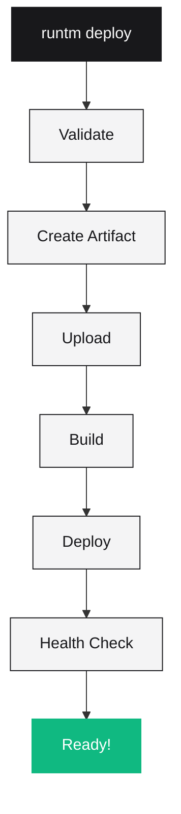

# runtm deploy

Deploy your agent's work to a live HTTPS URL. Your agent can use this URL to test, share, and iterate.

```bash
runtm deploy [path]
```

## Arguments

| Argument | Required | Description |
|----------|----------|-------------|
| `path` | No | Path to project (default: `.`) |

## Options

| Option | Short | Description |
|--------|-------|-------------|
| `--tier TIER` | | Machine tier: `starter`, `standard`, `performance` |
| `--wait/--no-wait` | | Wait for deployment to complete (default: wait) |
| `--timeout N` | `-t` | Timeout in seconds (default: 500) |
| `--yes` | `-y` | Auto-fix lockfile issues without prompting |
| `--config-only` | | Skip Docker build, reuse previous image |
| `--skip-validation` | | Skip Python import validation |
| `--force-validation` | | Force re-validation even if cached |
| `--new` | | Create new deployment (loses domains/secrets) |

## Examples

### Basic Deployment

```bash
# Deploy current directory
runtm deploy

# Deploy specific project
runtm deploy ./my-project
```

### Machine Tiers

```bash
# Deploy with standard tier (512MB RAM)
runtm deploy --tier standard

# Deploy with performance tier (1GB RAM)
runtm deploy --tier performance
```

### Auto-Fix Issues

```bash
# Auto-fix lockfile without prompting
runtm deploy --yes
```

### Quick Config Changes

```bash
# Skip Docker build for env/tier changes only
runtm deploy --config-only
```

### Non-Blocking Deploy

```bash
# Don't wait for completion
runtm deploy --no-wait
```

## Deployment Flow



## Redeployment

When you deploy a project with the same name, Runtm automatically **redeploys**:

- URL stays the same
- Secrets are preserved
- Custom domains are preserved
- Version number increments

This is perfect for agent workflows—your agent can deploy, see logs, fix bugs, and redeploy in a tight loop:

```bash
# First deploy creates dep_abc123 at https://my-app-xyz.fly.dev
runtm deploy

# Agent fixes a bug based on logs, then redeploys
runtm deploy
```

### Force New Deployment

Use `--new` to create a completely new deployment:

<Warning>
  `--new` will:
  - Create a new URL
  - NOT transfer custom domains
  - NOT transfer secrets
</Warning>

```bash
runtm deploy --new
```

## Machine Tiers

| Tier | Memory | CPUs | Best for |
|------|--------|------|----------|
| `starter` | 256 MB | 1 shared | Simple APIs, webhooks |
| `standard` | 512 MB | 1 shared | Web apps, fullstack |
| `performance` | 1 GB | 2 shared | AI/ML, heavy workloads |

All tiers use **suspended state**—machines pause when idle and resume quickly on requests.

<Note>
The `web-app` template requires `standard` or higher.
</Note>

## Config-Only Deploys

Use `--config-only` for fast updates that don't change code:

```bash
# Change tier without rebuilding
runtm deploy --tier performance --config-only

# The Docker image from the previous deploy is reused
```

<Warning>
  `--config-only` fails if source code has changed since last deploy.
</Warning>

## Validation

The deploy command validates your project:

1. **Manifest** - `runtm.yaml` is valid
2. **Lockfile** - Dependencies are locked
3. **Imports** - Python imports work (optional)

### Skip Validation

```bash
# Skip Python import validation (faster but riskier)
runtm deploy --skip-validation
```

### Force Re-validation

```bash
# Ignore validation cache
runtm deploy --force-validation
```

## Output

Successful deployment shows:

```
✓ Validated project
✓ Created artifact (2.1 MB)
✓ Uploading...
✓ Building... (45s)
✓ Deploying... (12s)

🚀 Deployed!

   URL: https://my-app-xyz123.fly.dev
   ID:  dep_abc123xyz

   View logs: runtm logs dep_abc123xyz
```

## Troubleshooting

<AccordionGroup>
  <Accordion title="Lockfile error">
    Fix automatically:
    ```bash
    runtm deploy --yes
    ```
    Or manually:
    ```bash
    runtm fix
    runtm deploy
    ```
  </Accordion>
  <Accordion title="Artifact too large (> 20MB)">
    Update `.runtmignore` to exclude:
    ```gitignore
    node_modules/
    .venv/
    __pycache__/
    .git/
    ```
  </Accordion>
  <Accordion title="Build timeout">
    Large dependencies can cause timeouts. Consider:
    - Using smaller base images
    - Caching dependencies
    - Removing unused packages
  </Accordion>
  <Accordion title="Health check failed">
    Ensure `/health` endpoint:
    - Returns 200 status code
    - Responds within 100ms
    - Works without authentication
  </Accordion>
  <Accordion title="Import validation failed">
    Check `pyproject.toml` has runtime dependencies in `[project] dependencies`, not `[project.optional-dependencies] dev`.
  </Accordion>
</AccordionGroup>

## Related Commands

- [`runtm status`](/cli/status) - Check deployment status
- [`runtm logs`](/cli/logs) - View deployment logs
- [`runtm destroy`](/cli/destroy) - Remove a deployment

