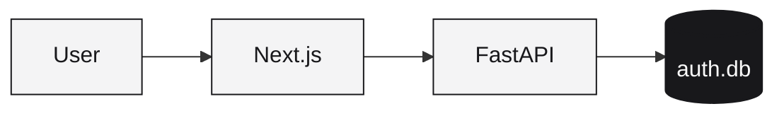

# Authentication Feature

Enable user authentication in your `web-app` template using Better Auth.

<Note>
  Authentication is only available for the `web-app` template and requires the database feature.
</Note>

## How it works



Sessions are managed by Better Auth and stored in a separate SQLite database (`/data/auth.db`).

## Enabling Authentication

Add to your `runtm.yaml`:

```yaml
features:
  database: true  # Required
  auth: true

env_schema:
  - name: AUTH_SECRET
    type: string
    required: true
    secret: true
    description: "Session signing secret (32+ chars)"
```

## Setup

### 1. Generate Secret

```bash
runtm secrets set AUTH_SECRET=$(openssl rand -base64 32)
```

### 2. Deploy

```bash
runtm deploy
```

## Frontend Usage

### Auth Hooks

```tsx
'use client';

import { useSession, signIn, signOut } from '@/lib/auth-client';

export function AuthStatus() {
  const { data: session, status } = useSession();

  if (status === 'loading') {
    return <span>Loading...</span>;
  }

  if (!session) {
    return (
      <button onClick={() => signIn()}>
        Sign In
      </button>
    );
  }

  return (
    <div>
      <span>Welcome, {session.user.email}</span>
      <button onClick={() => signOut()}>
        Sign Out
      </button>
    </div>
  );
}
```

### Protected Routes

Use `AuthGuard` to protect pages:

```tsx
// app/dashboard/page.tsx
import { AuthGuard } from '@/components/auth/AuthGuard';
import { Dashboard } from '@/components/Dashboard';

export default function DashboardPage() {
  return (
    <AuthGuard>
      <Dashboard />
    </AuthGuard>
  );
}
```

`AuthGuard` redirects unauthenticated users to the login page.

### Login Form

The template includes a ready-to-use login form:

```tsx
import { LoginForm } from '@/components/auth/LoginForm';

export default function LoginPage() {
  return (
    <div className="max-w-md mx-auto mt-20">
      <h1 className="text-2xl font-bold mb-6">Sign In</h1>
      <LoginForm />
    </div>
  );
}
```

## Auth Components

The template includes these components:

| Component | Purpose |
|-----------|---------|
| `LoginForm` | Email/password login |
| `SignupForm` | User registration |
| `AuthGuard` | Route protection |
| `SocialButtons` | OAuth providers (optional) |
| `MagicLinkForm` | Passwordless login (optional) |

## Backend Integration

### Getting Current User

```python
# backend/app/api/v1/me.py
from fastapi import APIRouter, Depends, HTTPException
from app.core.auth import get_current_user

router = APIRouter()

@router.get("/me")
async def get_me(user = Depends(get_current_user)):
    if not user:
        raise HTTPException(status_code=401, detail="Not authenticated")
    return user
```

### Protected Endpoints

```python
from fastapi import Depends
from app.core.auth import require_auth

@router.get("/protected")
async def protected_route(user = Depends(require_auth)):
    return {"message": f"Hello, {user['email']}"}
```

## Session Storage

Sessions are stored in a separate SQLite database at `/data/auth.db`. This keeps auth data isolated from your application data.

## OAuth Providers (Optional)

To add social login (Google, GitHub, etc.), configure providers:

```typescript
// frontend/lib/auth.ts
import { betterAuth } from 'better-auth';

export const auth = betterAuth({
  // ... base config
  socialProviders: {
    google: {
      clientId: process.env.GOOGLE_CLIENT_ID!,
      clientSecret: process.env.GOOGLE_CLIENT_SECRET!,
    },
    github: {
      clientId: process.env.GITHUB_CLIENT_ID!,
      clientSecret: process.env.GITHUB_CLIENT_SECRET!,
    },
  },
});
```

Add to manifest:

```yaml
env_schema:
  - name: AUTH_SECRET
    type: string
    required: true
    secret: true
  - name: GOOGLE_CLIENT_ID
    type: string
    required: false
  - name: GOOGLE_CLIENT_SECRET
    type: string
    required: false
    secret: true
```

## Customization

### Custom Login Page

```tsx
// app/login/page.tsx
export default function CustomLoginPage() {
  return (
    <div className="min-h-screen flex items-center justify-center bg-gray-100">
      <div className="bg-white p-8 rounded-lg shadow-md w-full max-w-md">
        <h1 className="text-2xl font-bold text-center mb-6">
          Welcome Back
        </h1>
        <LoginForm 
          redirectTo="/dashboard"
          showSignup={true}
        />
      </div>
    </div>
  );
}
```

### Redirect After Login

```tsx
<LoginForm redirectTo="/dashboard" />
```

## Best Practices

<AccordionGroup>
  <Accordion title="Generate a strong secret">
    Use at least 32 characters:
    ```bash
    openssl rand -base64 32
    ```
  </Accordion>
  <Accordion title="Never expose AUTH_SECRET">
    Keep it in `.env.local` and never commit to git.
  </Accordion>
  <Accordion title="Use HTTPS">
    Runtm provides HTTPS by default. Never disable it for auth.
  </Accordion>
  <Accordion title="Add rate limiting">
    Consider adding rate limiting to auth endpoints to prevent brute force.
  </Accordion>
</AccordionGroup>

## Troubleshooting

<AccordionGroup>
  <Accordion title="'AUTH_SECRET not set' error">
    Set the secret:
    ```bash
    runtm secrets set AUTH_SECRET=$(openssl rand -base64 32)
    runtm deploy
    ```
  </Accordion>
  <Accordion title="'features.auth requires database'">
    Enable database in manifest:
    ```yaml
    features:
      database: true
      auth: true
    ```
  </Accordion>
  <Accordion title="Session not persisting">
    Check that cookies are being set. Ensure you're accessing via HTTPS.
  </Accordion>
  <Accordion title="'auth is only supported for web-app'">
    Authentication only works with the `web-app` template, not `backend-service` or `static-site`.
  </Accordion>
</AccordionGroup>

