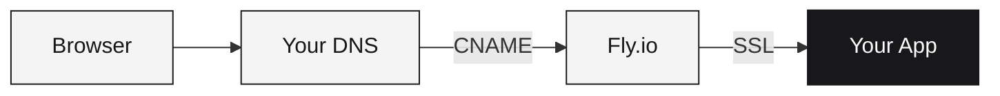

# Custom Domains

Connect your own domain name to any Runtm deployment with automatic SSL certificates.

## How it works



1. You add a CNAME record pointing to your Fly app
2. Fly.io handles SSL certificate provisioning via Let's Encrypt
3. Traffic flows through Fly's edge to your app

## Adding a Domain

### Via CLI

```bash
runtm domain add dep_abc123xyz api.example.com
```

### Via API

```bash
curl -X POST "https://app.runtm.com/api/v0/deployments/dep_abc123xyz/domains" \
  -H "Authorization: Bearer runtm_xxx" \
  -H "Content-Type: application/json" \
  -d '{"hostname": "api.example.com"}'
```

## DNS Configuration

After adding a domain, configure DNS at your registrar.

### Subdomains (CNAME)

For subdomains like `api.example.com` or `app.example.com`:

| Type | Name | Value |
|------|------|-------|
| CNAME | `api` | `your-app-xyz.fly.dev` |

### Apex Domains

For apex domains like `example.com` (without subdomain), use A records pointing to Fly.io IPs. Contact support for apex domain setup.

## SSL Certificates

Certificates are automatically provisioned via Let's Encrypt:

1. You add the domain
2. Runtm creates a certificate request
3. DNS is verified (you configure the CNAME)
4. Certificate is issued (~1-5 minutes after DNS propagates)

### Certificate Status

Check certificate status:

```bash
runtm domain status dep_abc123xyz api.example.com
```

| Status | Meaning |
|--------|---------|
| `pending` | Waiting for DNS verification |
| `issued` | Certificate active, domain working |
| `failed` | Verification failed, check DNS |

## Complete Workflow

<Steps>
  <Step title="Deploy your app">
    ```bash
    runtm deploy
    # Note the deployment ID: dep_abc123xyz
    ```
  </Step>
  <Step title="Add custom domain">
    ```bash
    runtm domain add dep_abc123xyz api.example.com
    ```
  </Step>
  <Step title="Configure DNS">
    Add CNAME record at your registrar:
    - Name: `api`
    - Value: `your-app-xyz.fly.dev`
  </Step>
  <Step title="Wait for propagation">
    DNS changes typically propagate in minutes but can take up to 48 hours.
  </Step>
  <Step title="Verify">
    ```bash
    runtm domain status dep_abc123xyz api.example.com
    ```
    Visit `https://api.example.com` when status shows `issued`.
  </Step>
</Steps>

## Multiple Domains

You can add multiple domains to a single deployment:

```bash
runtm domain add dep_abc123xyz api.example.com
runtm domain add dep_abc123xyz api.example.org
runtm domain add dep_abc123xyz api.mycompany.com
```

## Removing a Domain

```bash
runtm domain remove dep_abc123xyz api.example.com
```

This removes the domain configuration and certificate. Don't forget to also remove the DNS record at your registrar.

## DNS Verification

### Check DNS Propagation

```bash
# Using dig
dig api.example.com CNAME

# Using nslookup
nslookup api.example.com
```

Expected output:
```
api.example.com.    300    IN    CNAME    your-app-xyz.fly.dev.
```

### Online Tools

- [whatsmydns.net](https://www.whatsmydns.net/) - Check global propagation
- [dnschecker.org](https://dnschecker.org/) - Multi-location DNS check

## Common DNS Providers

<AccordionGroup>
  <Accordion title="Cloudflare">
    1. Go to DNS settings
    2. Add CNAME record
    3. Set proxy status to "DNS only" (gray cloud)
    
    <Warning>
      Disable Cloudflare proxy (orange cloud) to avoid certificate conflicts.
    </Warning>
  </Accordion>
  <Accordion title="GoDaddy">
    1. Go to DNS Management
    2. Add CNAME record
    3. Name: `api`, Value: `your-app.fly.dev`
  </Accordion>
  <Accordion title="Namecheap">
    1. Go to Advanced DNS
    2. Add new record → CNAME
    3. Host: `api`, Target: `your-app.fly.dev`
  </Accordion>
  <Accordion title="Route 53 (AWS)">
    1. Go to Hosted Zones
    2. Create Record
    3. Type: CNAME, Value: `your-app.fly.dev`
  </Accordion>
</AccordionGroup>

## Troubleshooting

<AccordionGroup>
  <Accordion title="Certificate stuck in 'pending'">
    1. Verify DNS is configured correctly:
       ```bash
       dig api.example.com CNAME
       ```
    2. Wait up to 48 hours for DNS propagation
    3. Ensure no conflicting A/AAAA records exist
  </Accordion>
  <Accordion title="'Deployment not ready' error">
    Custom domains only work with `ready` deployments:
    ```bash
    runtm status dep_abc123xyz
    ```
    Wait for deployment to complete, then add domain.
  </Accordion>
  <Accordion title="Certificate verification failed">
    Common causes:
    - Cloudflare proxy enabled (use DNS-only mode)
    - Wrong CNAME value
    - DNS not propagated yet
    
    Try removing and re-adding the domain:
    ```bash
    runtm domain remove dep_abc123xyz api.example.com
    runtm domain add dep_abc123xyz api.example.com
    ```
  </Accordion>
  <Accordion title="Domain shows old deployment">
    If you destroyed and recreated a deployment, the domain may point to the old app. Update the CNAME to the new Fly.io URL.
  </Accordion>
</AccordionGroup>

## Best Practices

<AccordionGroup>
  <Accordion title="Use subdomains">
    Subdomains (`api.example.com`) are easier to configure than apex domains.
  </Accordion>
  <Accordion title="Test with staging domain first">
    Add a test domain (`staging.example.com`) before production.
  </Accordion>
  <Accordion title="Keep TTL low initially">
    Use low TTL (300 seconds) during setup, increase after confirmed working.
  </Accordion>
  <Accordion title="Document your DNS setup">
    Keep a record of which domains point to which deployments.
  </Accordion>
</AccordionGroup>

