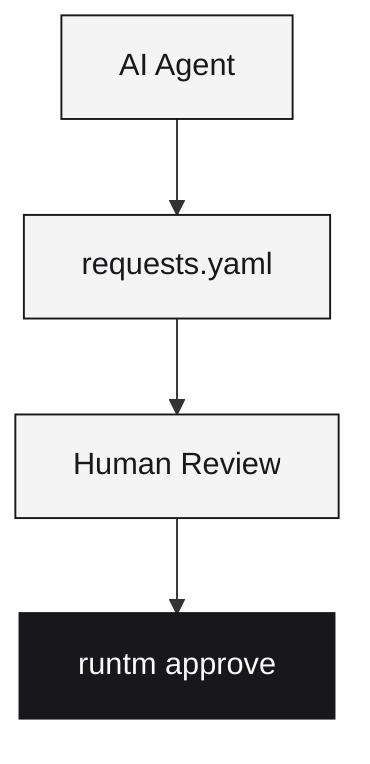

Runtm lets AI agents propose infrastructure changes while keeping humans in the loop. Agents can request features, secrets, and permissions—humans review and approve.

## How it works



1. AI agent creates `runtm.requests.yaml` with proposed changes
2. Human reviews the proposed changes
3. Human runs `runtm approve` to merge changes into `runtm.yaml`
4. Human deploys

## The requests file

AI agents propose changes by creating `runtm.requests.yaml`:

```yaml
requested:
  features:
    database: true
    reason: "Need persistent storage for user data"
  
  env_vars:
    - name: STRIPE_API_KEY
      secret: true
      required: true
      reason: "Payment processing"

notes:
  - "Adding Stripe integration for payments"
```

## Reviewing changes

Preview what would change:

```bash
runtm approve --dry-run
```

## Applying changes

If everything looks good:

```bash
runtm approve
```

This merges the requested changes into `runtm.yaml` and deletes the requests file.

To reject, simply delete the file:

```bash
rm runtm.requests.yaml
```

## What agents can request

### Features

```yaml
requested:
  features:
    database: true
    auth: true       # web-app only
    reason: "Why this is needed"
```

### Environment variables

```yaml
requested:
  env_vars:
    - name: API_KEY
      type: string
      secret: true
      required: true
      reason: "External API authentication"
```

### Egress allowlist

```yaml
requested:
  egress_allowlist:
    - "api.stripe.com"
    - "api.openai.com"
```

## For agent developers

If you're building an AI agent that integrates with Runtm:

```python
import yaml

request = {
    "requested": {
        "features": {
            "database": True,
            "reason": "Need persistent storage"
        },
        "env_vars": [
            {
                "name": "OPENAI_API_KEY",
                "secret": True,
                "required": True,
                "reason": "LLM API calls"
            }
        ]
    },
    "notes": ["Adding AI features"]
}

with open("runtm.requests.yaml", "w") as f:
    yaml.dump(request, f)
```

<Tip>
Always include a `reason` field explaining why each change is needed. It helps humans make informed decisions.
</Tip>

<Note>
In v1, `runtm approve` is informational only—deployments work without approval. Future versions will enforce policy compliance for organizations.
</Note>
