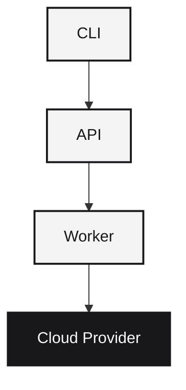

Runtm turns AI-generated code into live, governed endpoints. One command. Live URL. Done.

```bash
runtm deploy
```

<Info>
Runtm is **bring-your-own-cloud**. We start with Fly.io as the default provider, with AWS and GCP support coming soon.
</Info>

<CardGroup cols={2}>
  <Card title="Quick Start" icon="rocket" href="/quickstart">
    Zero to deployed in 5 minutes
  </Card>
  <Card title="CLI Reference" icon="terminal" href="/cli/overview">
    Complete command reference
  </Card>
  <Card title="Templates" icon="cube" href="/templates/overview">
    Production-ready starting points
  </Card>
  <Card title="Self-Hosting" icon="server" href="/self-hosting/overview">
    Run on your own infrastructure
  </Card>
</CardGroup>

## Who uses Runtm?

Runtm is built for developers shipping AI-generated code—whether you're building with Cursor, Claude, or another coding agent. It's also great for teams building internal tools, OSS hackers who want reproducible runtimes, and founders who want control without rebuilding a PaaS.

## How it works

The CLI packages your code and sends it to the API control plane. Workers build Docker images and deploy to your cloud provider.



## Templates

Pick a template based on what you're building:

| Template | Runtime | Best for |
|----------|---------|----------|
| `backend-service` | Python | APIs, webhooks, agent backends |
| `static-site` | Node.js | Landing pages, docs |
| `web-app` | Fullstack | Dashboards, interactive apps |

All templates deploy without configuration. Just run `runtm deploy`.

## Cloud providers

Runtm is designed as a bring-your-own-cloud platform. Deploy to the provider that works best for you.

| Provider | Status |
|----------|--------|
| Fly.io | Available now |
| AWS | Coming soon |
| GCP | Coming soon |

<Note>
Self-hosters can implement custom providers using the provider interface.
</Note>

## Guardrails

Runtm enforces sensible limits by default:

| Constraint | Limit |
|------------|-------|
| Artifact size | 20 MB |
| Build timeout | 10 minutes |
| Deploy timeout | 5 minutes |
| Rate limit | 10 deploys/hour |

## Get started

<Steps>
  <Step title="Install the CLI">
    ```bash
    uv tool install runtm
    ```
  </Step>
  <Step title="Authenticate">
    Sign up at [app.runtm.com](https://app.runtm.com) and run:
    ```bash
    runtm login
    ```
  </Step>
  <Step title="Deploy">
    ```bash
    runtm init backend-service
    runtm deploy
    ```
  </Step>
</Steps>
