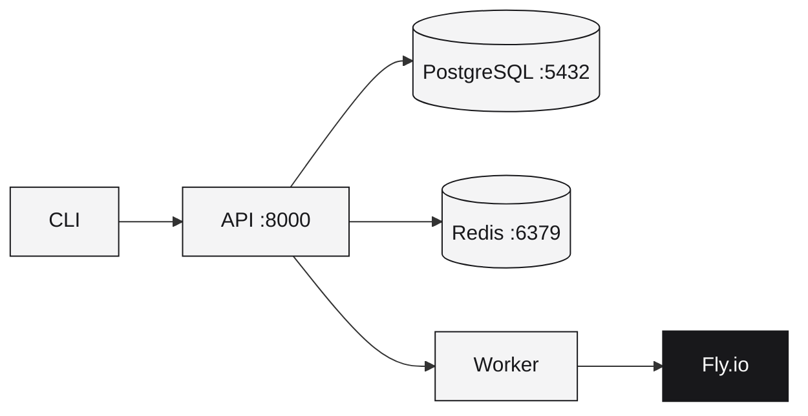

Run the complete Runtm stack locally using Docker Compose.

## Quick start

```bash
# Clone repository
git clone https://github.com/runtm-ai/runtm.git
cd runtm

# Copy environment template
cp infra/local.env.example .env

# Edit .env and add your FLY_API_TOKEN
vim .env

# Start services
./scripts/dev.sh up
```

Your API is now running at `http://localhost:8000`.

## Services



| Service | Port | Description |
|---------|------|-------------|
| `api` | 8000 | FastAPI control plane |
| `worker` | — | Background job processor |
| `postgres` | 5432 | PostgreSQL 15 |
| `redis` | 6379 | Redis 7 job queue |

## Dev script commands

The `./scripts/dev.sh` helper makes common operations easy:

| Command | Description |
|---------|-------------|
| `./scripts/dev.sh up` | Start all services |
| `./scripts/dev.sh down` | Stop all services |
| `./scripts/dev.sh restart` | Restart all services |
| `./scripts/dev.sh rebuild` | Rebuild images and restart |
| `./scripts/dev.sh reset-db` | Drop all data and reset database |
| `./scripts/dev.sh logs [service]` | View logs (all or specific service) |
| `./scripts/dev.sh migrate` | Run database migrations manually |
| `./scripts/dev.sh test` | Run test suite |
| `./scripts/dev.sh lint` | Run linter |
| `./scripts/dev.sh format` | Format code |

### Common workflows

<Tabs>
  <Tab title="Start fresh">
    ```bash
    ./scripts/dev.sh up
    ```
    Starts all services. Migrations run automatically.
  </Tab>
  <Tab title="After code changes">
    ```bash
    ./scripts/dev.sh rebuild
    ```
    Rebuilds Docker images and restarts services.
  </Tab>
  <Tab title="Reset everything">
    ```bash
    ./scripts/dev.sh reset-db
    ```
    Drops all data and recreates the database.
  </Tab>
  <Tab title="View logs">
    ```bash
    ./scripts/dev.sh logs          # All services
    ./scripts/dev.sh logs api      # Just API
    ./scripts/dev.sh logs worker   # Just worker
    ```
  </Tab>
</Tabs>

## Environment setup

### Required variables

Edit `.env` and set these:

```bash
# REQUIRED: Fly.io personal access token
# Get with: fly auth token
FLY_API_TOKEN=FlyV1_your_token_here

# API secret (generate with: openssl rand -base64 32)
RUNTM_API_SECRET=your-random-secret-at-least-32-chars
```

<Warning>
Use a **Personal Access Token** from `fly auth token`, not a deploy token. Deploy tokens don't have access to the Logs API.
</Warning>

### Full configuration

See [Configuration](/self-hosting/configuration) for all environment variables.

## Configure CLI

Point your CLI to the local instance:

```bash
# Set environment variables
export RUNTM_API_URL=http://localhost:8000
export RUNTM_API_KEY=dev-token-change-in-production

# Or use CLI config
runtm config set api_url=http://localhost:8000
runtm login --token dev-token-change-in-production --no-verify
```

## Create an API key

For production or multi-tenant setups, create proper API tokens:

```bash
# Exec into API container
docker compose -f infra/docker-compose.yml exec api bash

# Create token
python -m runtm_api.scripts.create_token \
  --tenant default \
  --principal admin \
  --scopes read,deploy,delete
```

See [Admin Commands](/self-hosting/admin-commands) for more token management options.

## Verify setup

```bash
# Check API health
curl http://localhost:8000/health

# Check services
docker compose -f infra/docker-compose.yml ps
```

## Troubleshooting

<AccordionGroup>
  <Accordion title="Port already in use">
    Check what's using the port:
    ```bash
    lsof -i :8000
    lsof -i :5432
    ```
    Stop the conflicting service or change ports in a `docker-compose.override.yml`.
  </Accordion>
  <Accordion title="Cannot connect to database">
    ```bash
    docker compose -f infra/docker-compose.yml ps postgres
    docker compose -f infra/docker-compose.yml logs postgres
    ```
  </Accordion>
  <Accordion title="Worker not processing jobs">
    ```bash
    docker compose -f infra/docker-compose.yml logs -f worker
    ```
    Check Redis connection and `FLY_API_TOKEN` in `.env`.
  </Accordion>
  <Accordion title="FLY_API_TOKEN errors">
    Ensure you're using a Personal Access Token:
    ```bash
    fly auth token
    ```
    Not a deploy token created with `fly tokens create deploy`.
  </Accordion>
  <Accordion title="Migrations not running">
    Migrations run automatically on API startup. To run manually:
    ```bash
    ./scripts/dev.sh migrate
    # Or inside container:
    docker compose -f infra/docker-compose.yml exec api alembic upgrade head
    ```
  </Accordion>
</AccordionGroup>

## Next steps

<CardGroup cols={2}>
  <Card title="Configuration" icon="gear" href="/self-hosting/configuration">
    All environment variables
  </Card>
  <Card title="Admin Commands" icon="terminal" href="/self-hosting/admin-commands">
    Manage API tokens
  </Card>
</CardGroup>
