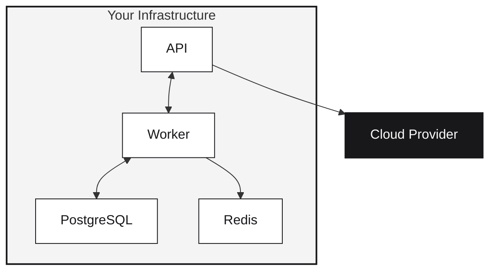

Runtm is fully open-source and designed for bring-your-own-cloud deployments. Run the control plane on your infrastructure and deploy to any supported provider.

## Why self-host?

<CardGroup cols={2}>
  <Card title="Data sovereignty" icon="shield">
    Keep deployment data and logs in your infrastructure
  </Card>
  <Card title="Custom configuration" icon="gear">
    Configure limits, policies, and integrations
  </Card>
  <Card title="Air-gapped environments" icon="lock">
    Deploy in networks without public internet
  </Card>
  <Card title="Provider flexibility" icon="cloud">
    Use your own cloud accounts and credentials
  </Card>
</CardGroup>

## Architecture



| Component | Purpose |
|-----------|---------|
| API | Control plane, handles CLI requests |
| Worker | Builds artifacts, deploys to provider |
| PostgreSQL | Stores deployment metadata |
| Redis | Job queue coordination |

## Provider support

Runtm is designed as a bring-your-own-cloud platform. The provider abstraction makes it straightforward to add new cloud targets.

| Provider | Status |
|----------|--------|
| Fly.io | Available |
| AWS | Planned |
| GCP | Planned |
| Custom | Implement `DeploymentProvider` interface |

## Quick start

```bash
git clone https://github.com/runtm-ai/runtm.git
cd runtm

cp infra/local.env.example .env
# Edit .env with your provider credentials

docker compose -f infra/docker-compose.yml up -d
```

Point your CLI to your self-hosted instance:

```bash
export RUNTM_API_URL=http://localhost:8000
export RUNTM_API_KEY=your-api-key
```

## Requirements

**Minimum:**
- 2 CPU cores, 4 GB RAM, 20 GB disk
- Docker 20.10+, Docker Compose 2.0+

**Production:**
- 4+ cores, 8 GB+ RAM, 100 GB+ SSD
- Managed PostgreSQL and Redis

## Licensing

| Component | License |
|-----------|---------|
| Server (API, Worker) | AGPLv3 |
| CLI, Shared | Apache 2.0 |
| Templates | MIT |

<Note>
AGPLv3 requires sharing modifications if you host for others. Standard self-hosting without code changes doesn't require this.
</Note>

## Next steps

<CardGroup cols={2}>
  <Card title="Requirements" icon="list-check" href="/self-hosting/requirements">
    Detailed system requirements
  </Card>
  <Card title="Docker Compose" icon="docker" href="/self-hosting/docker-compose">
    Local development setup
  </Card>
  <Card title="Configuration" icon="gear" href="/self-hosting/configuration">
    Environment variables
  </Card>
  <Card title="Admin commands" icon="terminal" href="/self-hosting/admin-commands">
    Token management
  </Card>
</CardGroup>
